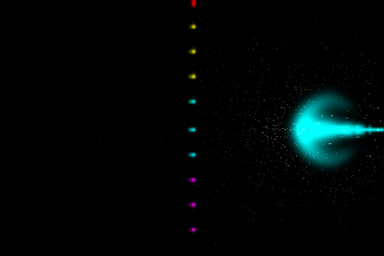
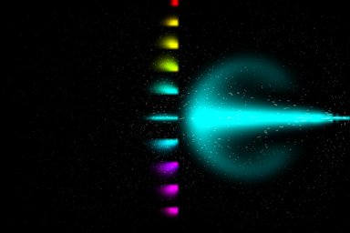
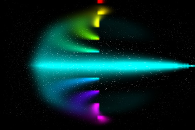

I've been trying out the  [MSAFluid library](http://www.memo.tv/msafluid_for_processing) by [Memo Akten](http://www.memo.tv/) for [Processing](http://processing.org).  Starting from the example program that comes with the library, I'm making a wind tunnel.  I've seperated adding force to the fluid, adding particles and adding dye so that I can add each where I want to.

Processing is fun because the sketching approach means that you see the results at each step, and this often provides weird / interesting visual results.  These images show my wind tunnel with a 'fan' emitting dye and then a set of dye emitters half way down the tunnel.  The particles are distributed through the fluid to show the flow.

