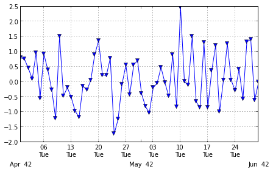
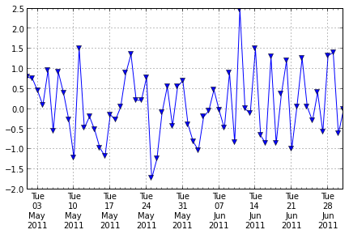

I've asked this question on StackOverflow (http://stackoverflow.com/questions/12945971/pandas-timeseries-plot-setting-x-axis-major-and-minor-ticks-and-labels), but couldn't include images because I haven't posted on stackOverflow before. So here it is, with the images.

I want to be able to set the major and minor xticks and their labels for a time series graph plotted from a Pandas time series object.

The Pandas 0.9 "what's new" page says: "you can either use to_pydatetime or register a converter for the Timestamp type" but I can't work out how to do that so that I can use the matplotlib ax.xaxis.set_major_locator ax.xaxis.set_major_formatter (and minor) commands.

If I use them without converting the pandas times, the x-axis ticks and labels end up wrong.

By using the 'xticks' parameter I can pass the major ticks to pandas.plot, and then set the major tick labels. I can't work out how to do the minor ticks using this approach. (I can set the labels on the default minor ticks set by pandas.plot)

Here is my test code:


```python
import pandas
print 'pandas.__version__ is ', pandas.__version__
print 'matplotlib.__version__ is ', matplotlib.__version__

dStart = datetime.datetime(2011,5,1) # 1 May
dEnd = datetime.datetime(2011,7,1) # 1 July

dateIndex = pandas.date_range(start=dStart, end=dEnd, freq='D')
print "1 May to 1 July 2011", dateIndex  

testSeries = pandas.Series(data=np.random.randn(len(dateIndex)), index=dateIndex)

ax = plt.figure(figsize=(7,4), dpi=300).add_subplot(111)
testSeries.plot(ax=ax, style='v-', label='first line')

# using MatPlotLib date time locators and formatters doesn't work with new pandas datetime index
ax.xaxis.set_minor_locator(matplotlib.dates.WeekdayLocator(byweekday=(1),interval=1))
ax.xaxis.set_minor_formatter(matplotlib.dates.DateFormatter('%d\n%a'))
ax.xaxis.grid(True, which="minor")
ax.xaxis.grid(False, which="major")
ax.xaxis.set_major_formatter(matplotlib.dates.DateFormatter('\n\n\n%b%Y'))
plt.show()

# set the major xticks and labels through pandas
ax2 = plt.figure(figsize=(7,4), dpi=300).add_subplot(111)
xticks = pandas.date_range(start=dStart, end=dEnd, freq='W-Tue')
print "xticks: ", xticks
testSeries.plot(ax=ax2, style='-v', label='second line', xticks=xticks.to_pydatetime())
ax2.set_xticklabels([x.strftime('%a\n%d\n%h\n%Y') for x in xticks]);
# set the text of the first few minor ticks created by pandas.plot
#    ax2.set_xticklabels(['a','b','c','d','e'], minor=True)
# remove the minor xtick labels set by pandas.plot 
ax2.set_xticklabels([], minor=True)
# turn the minor ticks created by pandas.plot off 
# plt.minorticks_off()
plt.show()
print testSeries['6/1/2011':'6/7/2011']

```

and it's output:

```
pandas.__version__ is  0.9.1.dev-3de54ae
matplotlib.__version__ is  1.1.1
1 May to 1 July 2011 <class 'pandas.tseries.index.DatetimeIndex'>
[2011-05-01 00:00:00, ..., 2011-07-01 00:00:00]
Length: 62, Freq: D, Timezone: None
``` 




```
[2011-05-03 00:00:00, ..., 2011-06-28 00:00:00]
Length: 9, Freq: W-TUE, Timezone: None
```



```
2011-06-04   -0.199393
2011-06-05   -0.043118
2011-06-06    0.477771
2011-06-07   -0.033207
Freq: D
```

 
